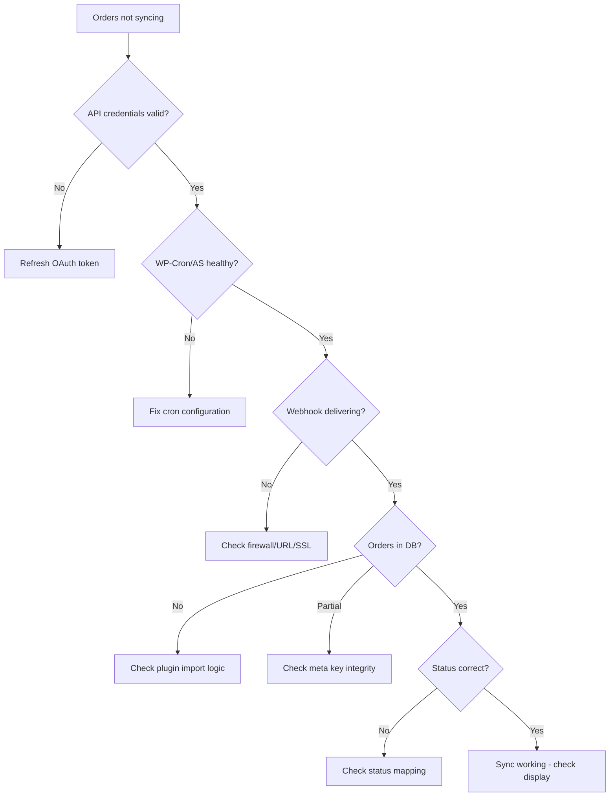

# ebay-wc-sync

Diagnostic skill for debugging eBay-to-WooCommerce order sync failures.

## The Problem

You sell on eBay. You use WooCommerce. An integration plugin is supposed to
bring eBay orders into WooCommerce automatically. And it works — until it
doesn't.

When sync breaks, the symptoms are vague. Orders just stop appearing. No
error messages. Your plugin settings look fine. You're left refreshing the
WooCommerce orders page wondering where your sales went.

This skill gives an AI coding agent (or you, manually) the exact queries,
commands, and decision trees to find where orders get lost. It covers the
most common integration plugins and the eBay API quirks that trip up every
single one of them.

## Quick Start

### Claude Code

```bash
claude plugin add axcrockett/ebay-wc-sync
```

### OpenSkills

```bash
npx openskills install axcrockett/ebay-wc-sync
```

### Manual

```bash
git clone https://github.com/axcrockett/ebay-wc-sync.git
```

Point your agent to `skills/ebay-wc-sync/SKILL.md`.

## What You Need

- Shell access to your WordPress server (SSH or similar)
- WP-CLI installed
- Ability to run database queries (`wp db query` or direct MySQL access)

Before running any SQL queries, grab your table prefix:

```bash
wp config get table_prefix --path=/var/www/html
```

All queries in the reference docs use `{prefix}` — swap in your real prefix.

## What It Covers

**Diagnostic workflow** — A step-by-step triage that walks through credentials,
cron health, webhooks, database integrity, and plugin-specific issues. Start
here when you don't know what's wrong.

**Common failures** — The 8 things that break most often: webhook delivery,
OAuth expiry, SKU mismatches, category drift, stuck orders, duplicates,
missing customer data, and Action Scheduler overflow. Each one with the
specific commands to confirm and fix it.

**Database investigation** — A library of SQL queries for finding orphaned
orders, duplicates, missing data, stuck imports, and more.

**eBay API guide** — eBay has three overlapping APIs (Trading, Inventory,
Fulfillment) that are partially incompatible with each other. This explains
which one your plugin uses and why that matters.

**Plugin-specific debugging** — CedCommerce, Codisto, QuickSync, and WebKul
each have their own meta keys, scheduler hooks, and failure modes.
CedCommerce gets the deepest coverage since it's the most widely used.

**WP-Cron health** — Most sync happens through scheduled tasks. If WP-Cron
or Action Scheduler is broken, nothing syncs. This covers diagnosis and repair.

## Diagnostic Flowchart



Most problems are caught in the first three checks: expired credentials,
broken cron, or webhook delivery failures. If orders are making it into the
database, the issue is usually metadata or status mapping — annoying but
fixable.

## Supported Plugins

| Plugin | What's covered |
|--------|----------------|
| **CedCommerce** | Meta keys, Action Scheduler hooks, 4 known failure modes, credential storage, update lock patterns |
| **Codisto** | Custom sync tables, webhook architecture, WooCommerce version conflicts |
| **QuickSync** (WP-Lister) | Configuration patterns, variation limits, cron dependency |
| **WebKul** | Hook priority conflicts, meta key prefixes |
| **Custom** | Common architectural mistakes checklist |

## How This Skill Works

There's no executable code here. No hooks, no scripts, no tests. This is
pure reference material — diagnostic workflows, SQL queries, WP-CLI commands,
and explanations of how these systems fail.

An AI agent reads SKILL.md, identifies which reference doc matches the
problem, reads that doc, and runs the commands on your server. Or you read
the docs yourself and run them manually. Either way works.

## Contributing

Found a failure mode that isn't covered? Know a plugin-specific gotcha?
[Open an issue](https://github.com/axcrockett/ebay-wc-sync/issues) or send
a pull request. Real-world debugging experiences are the most valuable
contributions.

When adding SQL queries, use `{prefix}` instead of `wp_` so they work on
any WordPress installation.

## License

[Apache-2.0](LICENSE)
