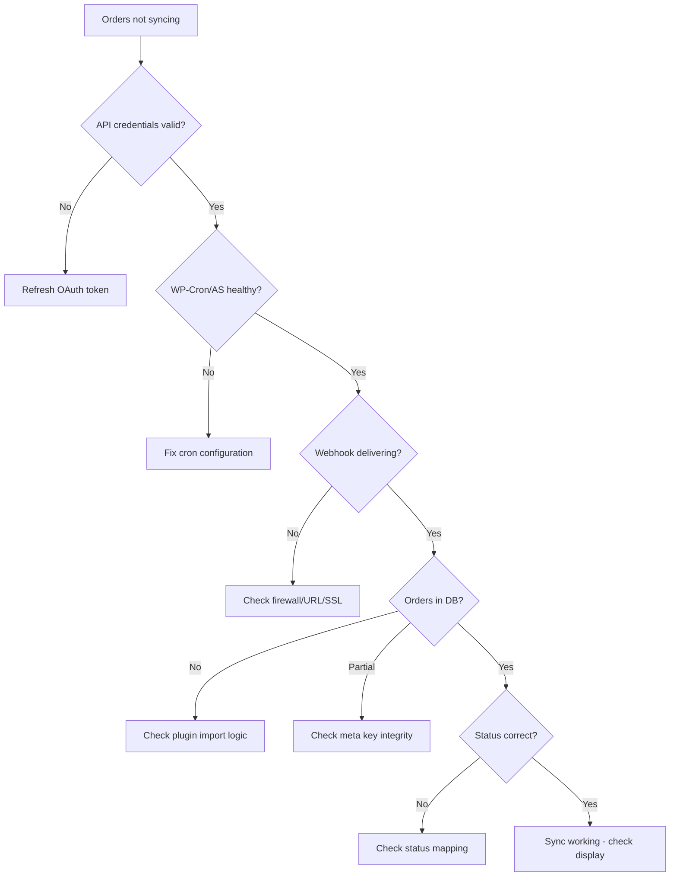

# Diagnostic Flowchart

## Mermaid Diagram

(Renders on GitHub and any Mermaid-compatible viewer)



## Text-Based Fallback

For agents that see raw Mermaid syntax instead of rendered diagrams:

```
START: Orders not syncing
  |
  v
[1] Are API credentials valid?
  |-- NO --> Refresh OAuth token (see api-guide.md)
  |-- YES
  v
[2] Is WP-Cron / Action Scheduler healthy?
  |-- NO --> Fix cron configuration (see wp-cron-health.md)
  |-- YES
  v
[3] Are webhooks delivering?
  |-- NO --> Check firewall, URL, SSL cert (see common-failures.md #1)
  |-- YES
  v
[4] Are orders present in the database?
  |-- NO --> Plugin import logic is broken (see plugin-specifics.md)
  |-- PARTIAL --> Check meta key integrity (see db-investigation.md)
  |-- YES
  v
[5] Is the order status correct?
  |-- NO --> Check status mapping (see common-failures.md #5)
  |-- YES --> Sync is working. Problem is in display/reporting, not sync.
```

## When to Use This

Start here when you don't know what's wrong. Work top to bottom. Each "NO"
branch points you to the right reference doc with the exact commands to run.

Most sync failures are found at steps 1-3. If you get to step 4, the hard
part (getting orders into WooCommerce) is working and the issue is usually
a metadata or status mapping problem.
